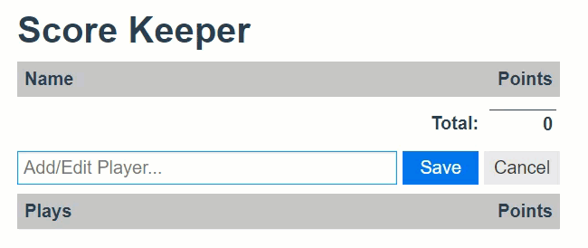
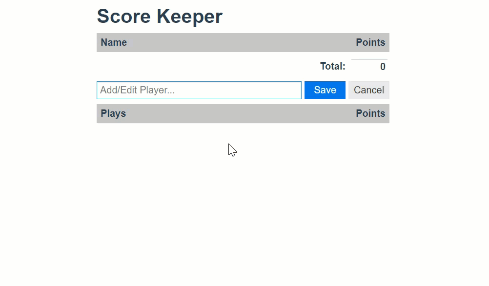

# Planning Basketball Scorekeeper App


Try Demo [Score Keeper](https://perrautc.github.io/scorekeeper/)
## Model

TODO: Model's Shape

```elm
Model =
    { players: List Player
    , playerName: String
    , playerId : Maybe Int
    , plays : List Play
    }

```

TODO: Player Shape

```Player =
    { id: Int
    , name : String
    , points : Int
    }```
TODO: Play Shape

```elm
Play =
    { id: Int
    , playerId: Int
    , name: String
    , points: Int
    }
```

TODO: Initial Model

## Update

What can be done in our app?

* Edit
* Score
* Input
* Save
* Cancel
* DeletePlay

TODO: Create Message Union Type

TODO: Create update function(s)

## View

What are the Logical Scetions/Groupings of our UI?

* main view (outermost function)
	* player list header
	* player list
		* player
	* player form
	* play section
		* play list header
		* play list
			* play

TODO: Create functions for each of the above